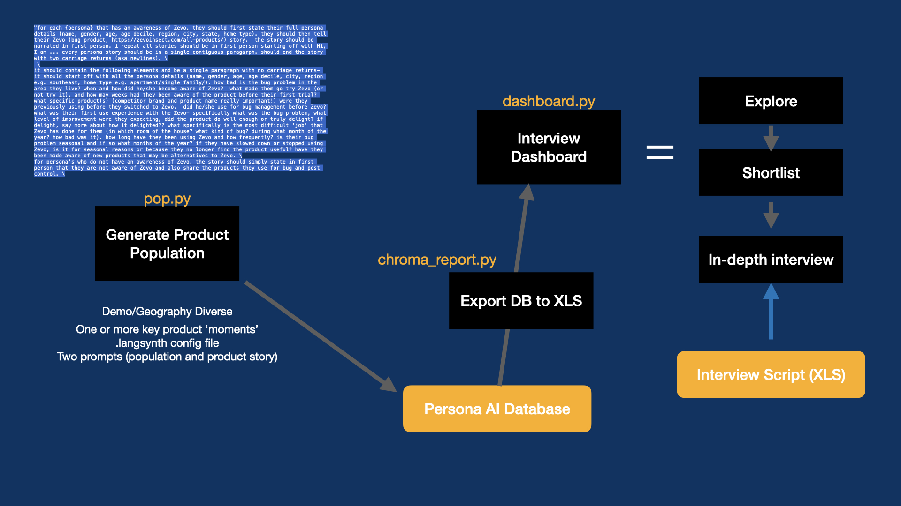

# LangSynth

## Vision (short form)
AI hitherto has been 'big company' friendly. This work hopes to be a small contribution in democratizing GenAI application frameworks to enable consumer insights in small organizations (startups, educational institutions and non-profits) - in particular in performing consumer insights in cost effective ways on entirely synthetic populations with speed and steerability. LangSynth (built on LangChain) enables these organizations to quickly stand up synthetic audiences and test them as interview panels with entirely synthetic interviews. LangSynth can be used as a precursor to, in addition to, or in order to broaden traditional panels.

Demo video in this repo gives you an aerial view of the system

## Architecture

The core capability is as follows:
- pop.py allows you to create a population of synthetic persona. For now the prompts are specific to Zevo. The persona are stored in a Chroma database called '.zevo' (which is hardwired in the code at the moment. ). currently there is a .zevo checked-in with about 100 persona ('cp -R dotzevo .zevo')
- chroma_report.py reads the zevo chroma DB, makes some correcitons to the 'liberties' that GPT took in naming regions and such. It then publishes the corrected database entries to a 'population.xls' file for the dashboard to access
- dashboard.py. this generates a synthetic person dashboard. this dashboard provides functionality to explore the synth population, select persona of interest and interview them. you can load a survey into the dashboard (one is provided as an example). synth interviews are conducted one synth at a time
- .langsynth is the config file to configure Chroma database name (db_dir), the persona prompt (persona_prompt), the product story you want to interview them on (product_prompt) and the excel file interface between the database and the dashboard

## Top of Mind Things to eventually improve
- chroma_report.py: have build a schema agnostic 'data repair' capability that is able to fix LLM wanderings in Chroma and publish the cleaned up entries to an XLS for the dashboard to ingest
- dashboard.py: enable dashboard to interact with more than one chroma database my adding a database selector. enable interviews to be exported to either an XLS or published into Chroma

## Future Use Cases
Work with Jonathan Engelsma and team @ Grand Valley State to enhance this to support education experience

## License
Apache 2.0 style free for use (but with attribution - Venu Vasudevan, perbacco.ai)
